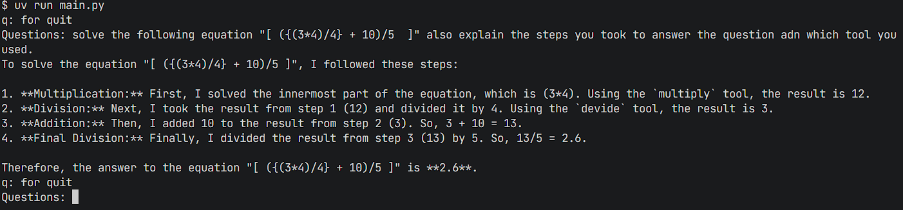

# Chapter 06: MCP with LangChain & LangGraph

## Introduction

Let'scombine the power of Model Context Protocol (MCP) with two essential AI frameworks: **LangChain** and **LangGraph**. This combination creates intelligent agents capable of handling complex, multi-step problems with precision and clarity.

### What is LangChain?

**LangChain** is a powerful framework designed to help developers build applications with Large Language Models (LLMs). It provides:
- **Chain Management**: Connect different components to create complex workflows
- **Tool Integration**: Seamlessly integrate external tools and APIs
- **Memory Systems**: Maintain context across conversations
- **Agent Capabilities**: Create autonomous agents that can reason and act

### What is LangGraph?

**LangGraph** is a library built on top of LangChain that specializes in creating **stateful, multi-actor applications** with LLMs. Key features include:
- **Graph-based Workflows**: Model complex decision flows as graphs
- **React Agents**: Implement the ReAct (Reasoning + Acting) pattern
- **State Management**: Handle complex state transitions
- **Multi-step Reasoning**: Enable agents to break down complex problems

## What we'll Build

We will create an enhanced calculator agent that combines:
- **MCP Client** for calculator server using LangChain
- **React Agent** using LangGraph for intelligent problem-solving

Agent will be capable of:
- Connecting to MCP servers through LangChain
- Using LangGraph's ReAct pattern for complex multi-step problems
- Explaining its reasoning process step-by-step
- Handling mathematical expressions with proper order of operations

## Project Structure

Instead of creating separate `client.py` and `agent.py` files like in previous chapters, we'll consolidate everything into a single `main.py` file that contains both client and agent code. This approach simplifies our project structure while maintaining all functionality.

```
calculator/
├── main.py     # Combined client and agent code
└── server.py   # MCP server with calculator tools
```

## Implementation

### Step 1: MCP Server (`server.py`)

First, let's create our calculator server with enhanced output formatting:

```python
from mcp.server.fastmcp import FastMCP

mcp = FastMCP("calculator")

def output_formator(number: int):
    return f"the asnwer is {number}"

@mcp.tool()
def add(a:int, b:int) -> str:
    ans = a + b
    return output_formator(ans)
    
@mcp.tool()
def subtract(a:int, b:int) -> str:
    ans = a - b
    return output_formator(ans)

@mcp.tool()
def multiply(a:int, b:int) -> str:
    ans = a * b
    return output_formator(ans)

@mcp.tool()
def devide(a:int, b:int) -> str:
    ans = a // b
    return output_formator(ans)

if __name__ == "__main__":
    mcp.run(transport="stdio")
```

**Key Points:**
- Each tool returns a formatted string with the result
- We use integer division (`//`) for the divide function
- The server runs on stdio transport for seamless integration

### Step 2: LangChain & LangGraph Client (`main.py`)

Now, let's create our intelligent agent that combines MCP, LangChain, and LangGraph:

```python
import os
from dotenv import load_dotenv
from langchain.chat_models import init_chat_model
from langgraph.prebuilt import create_react_agent
from langchain_mcp_adapters.client import MultiServerMCPClient
import asyncio

load_dotenv()

os.environ["GOOGLE_API_KEY"] = os.getenv("GOOGLE_API_KEY")
model = init_chat_model("gemini-2.5-flash", model_provider="google_genai")


async def run():
    client = MultiServerMCPClient(
            {
                "calculator": {
                    "command": "uv",
                    "args": ["run", "server.py"],
                    "transport": "stdio"
                }
            }
        )

    tools = await client.get_tools()
    agent = create_react_agent(model, tools)
    
    while True:
        print("q: for quit")
        user = input("Questions: ")
        if user == "q":
            break
        math_response = await agent.ainvoke({"messages": user})
        print(math_response["messages"][-1].content)

asyncio.run(run())

```

## Understanding the Code

### LangChain Integration
```python
from langchain.chat_models import init_chat_model
from langchain_mcp_adapters.client import MultiServerMCPClient
```
- **`init_chat_model`**: Initializes our language model (Gemini 2.5 Flash)
- **`MultiServerMCPClient`**: Connects to multiple MCP servers through LangChain

### LangGraph ReAct Agent
```python
from langgraph.prebuilt import create_react_agent
agent = create_react_agent(model, tools)
```
- **`create_react_agent`**: Creates a ReAct (Reasoning + Acting) agent
- The agent can reason about problems and decide which tools to use
- It automatically handles multi-step problem decomposition

### MCP Server Configuration
```python
client = MultiServerMCPClient({
    "calculator": {
        "command": "uv",
        "args": ["run", "server.py"],
        "transport": "stdio"
    }
})
```
- Configures the calculator server to run via `uv`
- Uses stdio transport for communication
- The client automatically discovers available tools

## Running the Application

### Prerequisites
Make sure you have these installed:
```bash
pip install python-dotenv langchain langgraph langchain-mcp-adapters
```

### Environment Setup
Create a `.env` file with your Google API key:
```
GOOGLE_API_KEY=your_google_api_key_here
```

### Execution
```bash
cd calculator
uv run server.py
uv run main.py
```

### Expected Output

When you run this agent, you'll see output similar to:



## Testing Complex Expressions

Try this complex mathematical expression:
```
solve the following equation "[ ({(3*4)/4} + 10)/5  ]" also explain the steps you took to answer the question and which tool you used.
```

The ReAct agent will:
1. **Reason** about the order of operations
2. **Act** by calling appropriate calculator tools
3. **Observe** the results
4. **Continue** until the problem is solved
5. **Explain** its reasoning process

## Summary

- Integrate MCP with LangChain for seamless tool connectivity
- Use LangGraph to create intelligent ReAct agents
- Build agents that can handle complex, multi-step mathematical problems
- Combine reasoning and action for transparent problem-solving

The combination of MCP, LangChain, and LangGraph creates a powerful foundation for building intelligent agents that can interact with external tools while maintaining clear reasoning processes. This approach scales well and can be extended to handle various types of problems beyond simple calculations.

---